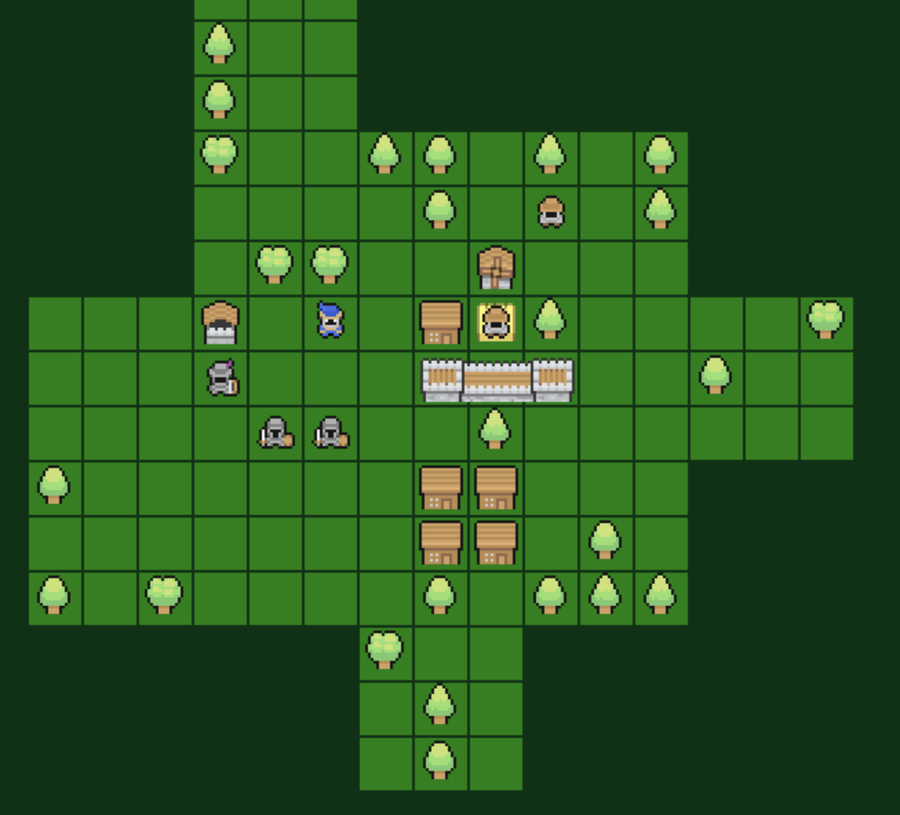

# 🏰 Kingdom Architect

> Medieval simulation/city builder game for the browser.

[About the project](#about-the-project)

[Play](#play)

[Development](#development)

[Contributing](#contributing)

[FAQ](#faq)

## 📜 About the project

Kingdom architects is intended to be a combined simulation and city building game around building your own kingdom and protecting it from hordes of evil monsters. It is intended to be single-player and playable both on mobile screens and desktop size clients. Your kingdom might last for decades or only seconds, once the browser is closed it's gone and only history might tell its tales.

### Goals for the project
- Play both using the keyboard and mouse/touch.
- Only depend on browser-apis, no extra libraries.
- Kingdoms are ephemeral, you should come back and create multiple kingdoms rather than having a single one for a long time

## 🕹️ Play

You can either clone this repository and run it based on the instructions on how to run the game below, or try the last version out at [https://kingdomarchitect.netlify.app](https://kingdomarchitect.netlify.app)

## 🙋 Contributing

### I have a suggestion for a feature
Great, if you feel like it aligns with the goal for the project open a thread under discussion with some details on your idea

### I have found a bug
Fantastic, getting bug reports is important. File an issue with steps to reproduce 🙏.

### I want to help code the game
Wow, thanks! First see if there are any open issues or open a thread under discussion on the improvement or contribution you would like to make.

## 👩‍💻 Development

Install the required development packages (typescript and webpack). You should then be able to run it with the `npm run start` command and get a link from webpack in your terminal to test out the locally built version. Your favourite IDE can be used to edit any game code. If you want to contribute on the development on the game, here follows some notes on the architecture for the game/application and some tools used during development

### Concepts
The architecture of the game is loosely based around three concepts:
- A timer ticking each second
- An entity tree and component system
- A state system for the HUD/GUI

#### Game updates
Ever second a timer invokes two code paths for most of the game components. An update function and a draw function.
The update function should only be invoked once per timer tick, but the draw method can be called multiple. Be wary of putting
logic depending on a timed update as it will be invoked potentially more than one time per tick when input events happen or other
actions are perfomed. Panning the gameworld is a good example of when the draw method of the different classes are invoked, this method
is executed on each drag event from the browser.

#### Entity component system
A entity component system is in the works where all items in the world are tied to an entity with some amount of componets on it handle updates and draw actions. Some exceptions exists like tiles where all tiles belong to the same entity with a component that is responsible for drawing and handling all the tiles. All new game world items and data will be stored in components on entities.

#### A state system for the HUD/GUI
Items that are not directly connected to the game world, like menus and screens are considered `InteractionStates` these are screens that can be navigated to and from in a stack. States can draw custom actions and handle events as well as setting up complex views using the custom UI system

### Folder Structure

| Folder name | Function                                                      |
|-------------|---------------------------------------------------------------|
| asset       | code related to load and lookup of assets can be found here.  |
| common      | generic code that can be used across the whole application    |
| game        | the game logic, both hud and world code                       |
| input       | code related to recieveing input from the browser             |
| path        | pathfinding and graphing code                                 |
| rendering   | code related to drawing pixels on the game canvas             |
| ui          | a custom ui system for setting up GUI elements and screens    |

### Tooling

Currently we only rely on typescript and webpack, but there will come custom tool scripts for things like bin-packing the assets into shared sheets.

### Testing
Some tests already exists for the game, these are made in mocha with chai as the assertion library. Some files are currently just scaffold and some contain actuall test code. These tests can be run with `npm run test`. We also have coverage, but this is not for the sake of the total coverage number but as a tool to check if you exercise what you expect to excersise in your test.

## ❓ FAQ

No questions so far