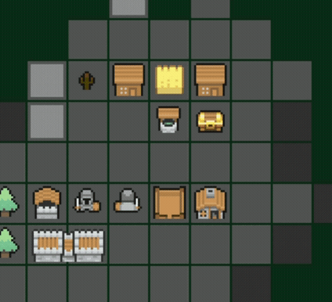

# 🏰 Kingdom Architect

[](https://www.typescriptlang.org/)
[](https://github.com/prettier/prettier)

Medieval simulation and city builder game for the browser. Built in typescript, featuring:
  - 🗺️ A custom ECS and scenegraph
  - 📐 It's own declarative UI framework
  - 🧠 A behaviour planner and system for npc, faction and city logic
  - 🎨 A 2D canvas renderer with typesafe asset references via codegen
  - 📡 Single and multiplayer architecture over websockets
  - 💾 Unified persistence for IndexedDB (singleplayer) and SQLite (multiplayer) with declarative migrations



## 🕹️ Play

> [!NOTE]  
> This game is currently in development. There will be things that are broken/not working/not implemented.

You can either clone this repository and run it based on the instructions on how to run the game below, or try the last version out at [https://kingdomarchitect.netlify.app](https://kingdomarchitect.netlify.app)

### How to play
- Gather resources build buildings
- Discover new lands
- Spawn heroes and defend against enemy mobs

### Controls
#### Pointer/Touch input
Tap the item you would like to select or activate

#### Keyboard input
- `WASD`: Use the W,A,S,D keys to move the cursor or selected items directionally
- `Escape`: Go back, cancel or unselect
- `E`: Activate the current selection or action
- `1-9`: Activate the n'th actionbar button
- `M`: Cycle between focus groups (e.g the action bar and selecting tiles in the world)
- `J`: Activate the first secondary actionbar item
- `K`: Activate the second secondary actionbar item

## 📜 About the project
Kingdom architects is intended to be a combined simulation and city building game around building your own kingdom and protecting it from hordes of evil monsters. Explore, build and complete quests. It is intended to be single or multi-player and playable both on mobile screens and desktop size clients. Your kingdom might last for decades or only seconds, who knows what the legends of your reign will be.

### Goals for the project
- Make it fun, both for playing and for developing.
- Play both using the keyboard and mouse/touch.
- Only depend on browser-apis, no extra libraries or third party frameworks.
- Progress in some way should be able to be carried over into future kingdoms, rogue-lite style.

## 🧱 Parts

### Declarative UI framework

A declarative UI for making UI's. Features non global hooks, state reconciliation and a combined layout and composition phase.

**Example:**

```typescript
const healthbar = createComponent<{ initialHealth: number }>(
    ({ props, withState, withEffect }) => {
        withEffect(() => {
            console.log('mounted!')
            return () => {
                console.log('disposed!');
            }
        })

        const [health, setHealth] = withState(props.initialHealth)
        
        return uiColumn({
            children: [
                uiText({
                    content: `current health: ${health}`,
                    textStyle: defaultTextStyle,
                }),
                uiButton({
                    label: 'increase hp',
                    onClick: () => {
                        setHealth(health + 1)
                    }
                })
            ],
            height: wrapUiSize,
            width: fillUiSize,
        })
    },
);
```

### Entity component system

An implementation of an ECS system with behaviours organised as systems and an entity tree that can be queried for components.

### Rendering

A rendering system with drawing for shapes, nine-patch sprites and animations via generated spritesheets.

### HUD state

A HUD state system for navigation.

### Multiplayer

Mulitplayer and singleplayer is generalised using a server running either remote or in a webworker.

## 🙋 Contributing
### I have a suggestion for a feature
Great, if you feel like it aligns with the about and goal for the project open a thread under discussion with some details on your idea.

### I have found a bug
Fantastic, getting bug reports is important. File an issue with steps to reproduce 🙏.

### I want to help code the game
Wow, thanks! First see if there are any open issues or open a thread under discussion on the improvement or contribution you would like to make.

## 👩‍💻 Development
### Requirements
- Node v24 or higher
- An editor to edit typescript with

### Get set up
Install the required development packages (typescript and rolldown) with `npm i`. Build and bundle the typescript source with `npm run build`. `npm run start` will start a development server and give you a link to test out the game locally. Use your favourite IDE to edit any typescript game code. If you want to contribute on the development on the game, here follows some notes on the architecture for the game/application and some tools used during development.

### Concepts
The architecture of the game is loosely based around three concepts:
- A timer ticking each second
- An entity tree and component system
- A state system for the HUD with a declarative UI

#### Game updates
Every second a timer invokes two code paths for most of the game components. An update function and a draw function.
The update function should only be invoked once per timer tick, but the draw method can be called multiple. Be wary of putting
logic depending on a timed update in the draw code path as it will be invoked potentially more than one time per tick when input events happen or other actions are perfomed. Panning the gameworld is a good example of when the draw method of the different classes are invoked, this method is executed on each drag event from the browser.

#### A state system for the HUD/GUI
Items that are not directly connected to the game world, like menus and screens are considered `InteractionStates` these are screens that can be navigated to and from in a stack. States can draw custom actions and handle events as well as setting up complex views using the custom UI system

### Tooling
#### Transpiling and bundling
Typescript and rollup is used for transpiling, typechecking and bundling the code.
This is performed with the `build` npm task.

### Testing
Some tests already exists for the game, these are made for the built in node test runner. Some files are currently just scaffold and some contain actual test code. Tests can be run with `npm test`.

### Custom tooling
#### Spritepacking
- **Task:** `spritepack`
- **Note:** typescript sources needs to be built before the task can run

To optimize, remove unused parts of images and bundling them together into a spritebin the `spritepack` npm task can be used. If you update any of the images in `asset` you need to run this task to get the updated version to show up in game. The source for this can be found in `ts/tool/spritepack`.

#### characterpacking
- **Task:** `characterpack`
- **Note:** typescript sources needs to be built before the task can run

To enable building dynamic character sprites, for example a knight with pink pants or a wizard with a sword we use this
task to parse custom colored spritesheets to derive positions of bodyparts during animation as well
as masking for the different parts. 

## ❓ FAQ
No questions so far
