# Goblin Behavior System Architecture

## Overview

This document describes the architecture for implementing goblin behaviors and the jobs-to-actions refactor.

## System Architecture

### Current vs New Action Flow

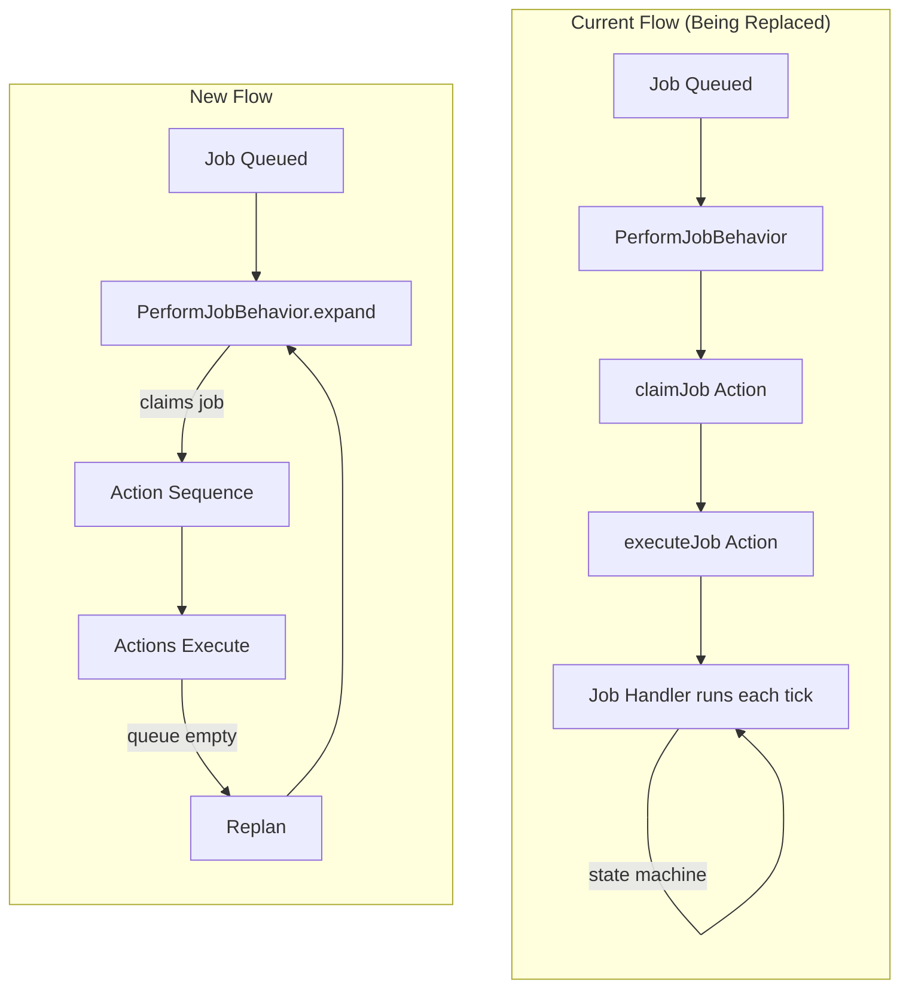

### Behavior System Loop

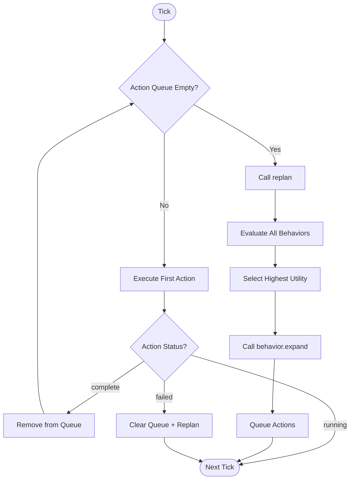

## Goblin Behavior Decision Tree

### KeepWarmBehavior expand() Logic

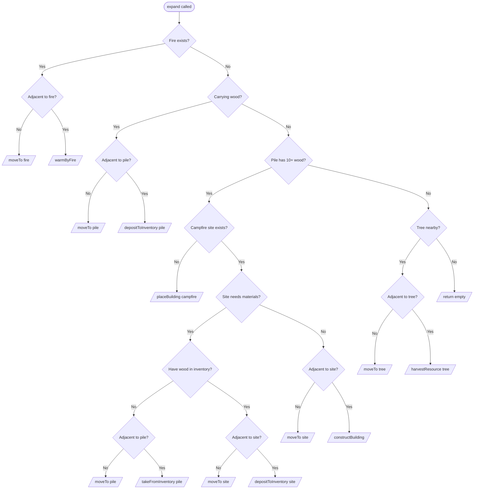

### Goblin Camp Progression

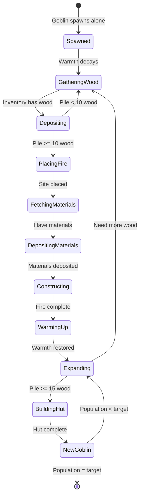

## Component Relationships

### Entity Component Diagram

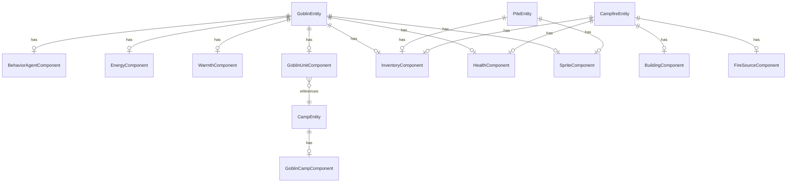

### Component Data

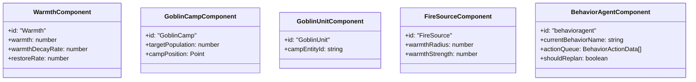

## Action Types

### Action Data Union

```mermaid
classDiagram
    class BehaviorActionData {
        <<union>>
    }

    class WaitAction {
        +type: "wait"
        +until: number
    }

    class MoveToAction {
        +type: "moveTo"
        +target: Point
    }

    class SleepAction {
        +type: "sleep"
    }

    class HarvestResourceAction {
        +type: "harvestResource"
        +targetEntityId: string
        +harvestMode: ResourceHarvestMode
        +workProgress: number
    }

    class ConstructBuildingAction {
        +type: "constructBuilding"
        +buildingEntityId: string
    }

    class TakeFromInventoryAction {
        +type: "takeFromInventory"
        +sourceEntityId: string
        +items: ItemRequest[]
    }

    class DepositToInventoryAction {
        +type: "depositToInventory"
        +targetEntityId: string
        +items: ItemRequest[]
    }

    class WarmByFireAction {
        +type: "warmByFire"
        +fireEntityId: string
    }

    class PlaceBuildingAction {
        +type: "placeBuilding"
        +buildingId: string
        +position: Point
    }

    BehaviorActionData <|-- WaitAction
    BehaviorActionData <|-- MoveToAction
    BehaviorActionData <|-- SleepAction
    BehaviorActionData <|-- HarvestResourceAction
    BehaviorActionData <|-- ConstructBuildingAction
    BehaviorActionData <|-- TakeFromInventoryAction
    BehaviorActionData <|-- DepositToInventoryAction
    BehaviorActionData <|-- WarmByFireAction
    BehaviorActionData <|-- PlaceBuildingAction
```

## PerformJobBehavior Refactor

### Job Expansion Flow

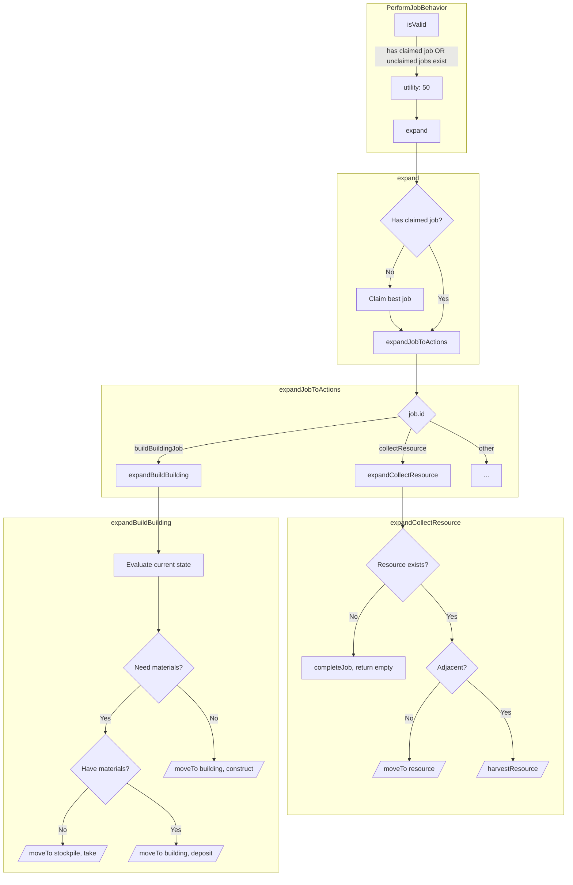

## System Integration

### System Registration

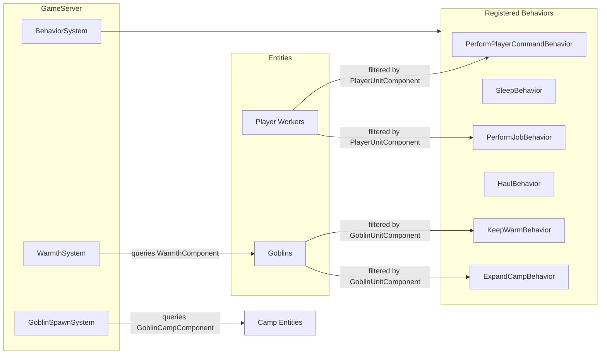

## File Structure

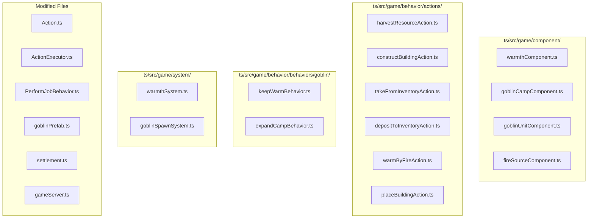

## Implementation Phases

```mermaid
gantt
    title Implementation Order
    dateFormat X
    axisFormat %s

    section Phase 1: Actions
    Add action types to Action.ts           :a1, 0, 1
    harvestResourceAction.ts                :a2, 1, 2
    constructBuildingAction.ts              :a3, 2, 3
    takeFromInventoryAction.ts              :a4, 3, 4
    depositToInventoryAction.ts             :a5, 4, 5
    placeBuildingAction.ts                  :a6, 5, 6
    Update ActionExecutor.ts                :a7, 6, 7

    section Phase 2: Job Refactor
    Refactor PerformJobBehavior             :b1, 7, 9
    Update BehaviorSystem cleanup           :b2, 9, 10
    Remove claimJob/executeJob              :b3, 10, 11
    Test player workers                     :b4, 11, 12

    section Phase 3: Components
    warmthComponent.ts                      :c1, 12, 13
    goblinCampComponent.ts                  :c2, 13, 14
    goblinUnitComponent.ts                  :c3, 14, 15
    fireSourceComponent.ts                  :c4, 15, 16
    pilePrefab.ts                           :c5, 16, 17

    section Phase 4: Behaviors
    warmByFireAction.ts                     :d1, 17, 18
    keepWarmBehavior.ts                     :d2, 18, 20
    expandCampBehavior.ts                   :d3, 20, 22

    section Phase 5: Systems
    warmthSystem.ts                         :e1, 22, 23
    goblinSpawnSystem.ts                    :e2, 23, 24

    section Phase 6: Integration
    Update goblinPrefab.ts                  :f1, 24, 25
    Update settlement.ts                    :f2, 25, 26
    Register in gameServer.ts               :f3, 26, 27
    Define goblin buildings                 :f4, 27, 28
```
